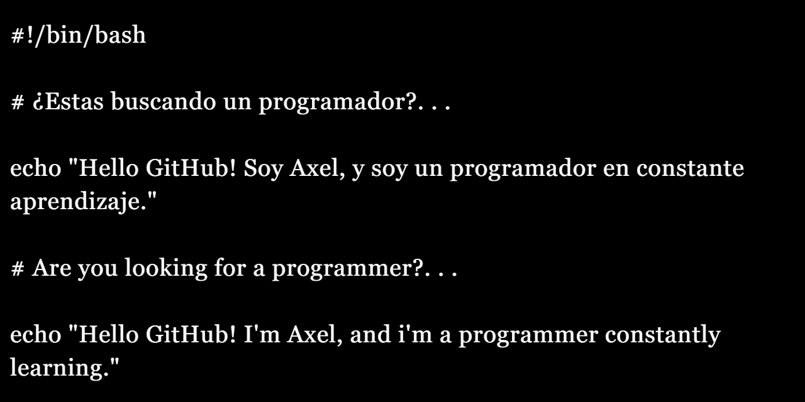

#  Luke, I am your coder.

---
> __💡 || ¡Hola mundo!__ Soy Axel, un programador junior dedicado a backend en proceso continuo de aprendizaje, en este perfil subiré todas mis ideas, proyectos, trabajos, practicas e incluso retos resueltos por mí. Cualquier consulta, sugerencia, propuesta e incluso consejo, hazmelo saber para poder mejorar y aprender sobre mis errores.

### 📌 || Collaborative Proyects:

🦈 • [SharkBytes](https://github.com/bruno-german/SharkBytes)

---

### 💻 || Technologies:

---

### 📝 || Tools:

---
